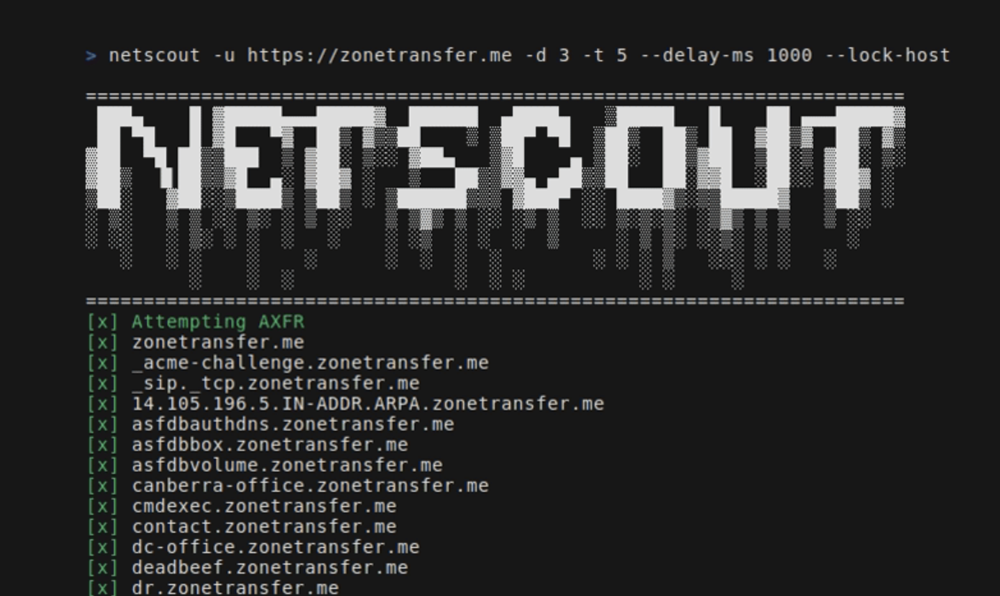

# NetScout


NetScout is an OSINT tool that finds domains, subdomains, directories, endpoints and files for a given seed URL.
It consists of the following components:
- BinaryEdge client: Gets subdomains
- DNS: Attempts to perform a DNS zone transfer to extract subdomains
- Crawler: Gets URLs and directories from the found subdomains + the seed url
- SERP client: Gets links for files. It uses Google dorking techniques to search for specific file types based on file extensions found by the crawler

## Setup
### How to install
- Go install:
      - Run ```go install github.com/caio-ishikawa/netscout@latest```
- Build from source:
      - Clone repository
      - Run ```make install```

## External APIs
NetScout uses two external APIs: BinaryEdge and SerpAPI.
BinaryEdge is used to query for historical data of subdomains registered to the seed URL, and SERP API is used to collect Google Search results for speficic filetypes for the seed URL.

### Setting API keys
NetScout expects the API keys to be set as environment variables:
- ```export BINARYEDGE_API_KEY="<key>"```
- ```export SERP_API_KEY="<key>"```

## Examples 
Usage:
```
=======================================================================
 ███▄    █ ▓█████▄▄▄█████▓  ██████  ▄████▄   ▒█████   █    ██ ▄▄▄█████▓
 ██ ▀█   █ ▓█   ▀▓  ██▒ ▓▒▒██    ▒ ▒██▀ ▀█  ▒██▒  ██▒ ██  ▓██▒▓  ██▒ ▓▒
▓██  ▀█ ██▒▒███  ▒ ▓██░ ▒░░ ▓██▄   ▒▓█    ▄ ▒██░  ██▒▓██  ▒██░▒ ▓██░ ▒░
▓██▒  ▐▌██▒▒▓█  ▄░ ▓██▓ ░   ▒   ██▒▒▓▓▄ ▄██▒▒██   ██░▓▓█  ░██░░ ▓██▓ ░ 
▒██░   ▓██░░▒████▒ ▒██▒ ░ ▒██████▒▒▒ ▓███▀ ░░ ████▓▒░▒▒█████▓   ▒██▒ ░ 
░ ▒░   ▒ ▒ ░░ ▒░ ░ ▒ ░░   ▒ ▒▓▒ ▒ ░░ ░▒ ▒  ░░ ▒░▒░▒░ ░▒▓▒ ▒ ▒   ▒ ░░   
░ ░░   ░ ▒░ ░ ░  ░   ░    ░ ░▒  ░ ░  ░  ▒     ░ ▒ ▒░ ░░▒░ ░ ░     ░    
   ░   ░ ░    ░    ░      ░  ░  ░  ░        ░ ░ ░ ▒   ░░░ ░ ░   ░      
         ░    ░  ░              ░  ░ ░          ░ ░     ░              
=======================================================================
Usage:
  -u string
        A string representing the URL
  -d int
        An integer representing the depth of the crawl
  -t int
        An integer representing the amount of threads to use for the scans (default 5)
  -delay-ms int
        An integer representing the delay between requests in miliseconds
  -lock-host
        A boolean - if set, it will only save URLs with the same host as the seed
  -o string
        A string representing the name of the output file
  -v
        A boolean - if set, it will display all found URLs

  -skip-axfr
        A bool - if set, it will skip the DNS zone trasnfer attempt
  -skip-binaryedge
        A bool - if set, it will skip BinaryEdge subdomain scan
  -skip-google-dork 
        A bool - if set, it will skip the Google filetype scan
  -headless
        A bool - if set, all requests in the crawler will be made through a headless Chrome browser (requires Google Chrome)
```

Sets seed url, depth, and output file:
```sh
netscout -u https://crawler-test -d 2 -o netscout.txt
```

Skips BinaryEdge and Google dork:
```sh
netscout -u https://crawler-test.com -d 2 --skip-binaryedge --skip-google-dork -o netscout.txt
```

Sets thread count to 5, req delay to 1000ms, and forces requests to be made throught a headless Chrome browser.
```sh
netscout -u https://crawler-test.com -d 2 -t 5 --delay-ms 1000 --headless -o netscout.txt
```

## Development
Before submitting a PR, please ensure that the project builds successfully and that all existing tests pass. More info at [Testing](#Testing)

Thank you for your interest in contributing to this project!

## Testing
The tests are placed in the same directory as the tested file, and the crawler tests require the [DVWA (Damn Vulnerable Web App)](https://github.com/citizen-stig/dockerdvwa/tree/master) to be running locally with port 80 exposed. 
All the setup needed for the tests are handled in the Makefile: 
- To pull the DVWA image, run ```make test-container-pull```
- To run the container ```make test-container-run```
- To setup the test files ```make testfiles-setup```
- To teardown the test files ```make testfiles-teardown```
- To run the tests ```make test```
